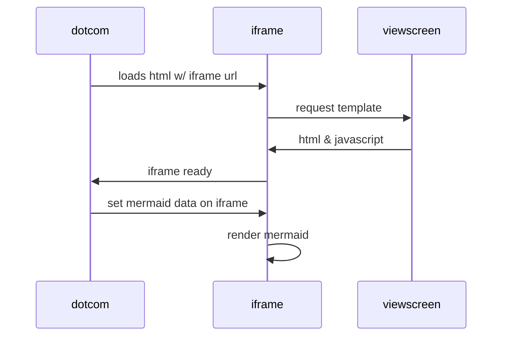

```mermaid
sequenceDiagram
    participant Alice
    participant John
    links Alice: {"Dashboard": "https://dashboard.contoso.com/alice", "Wiki": "https://wiki.contoso.com/alice"}
    links John: {"Dashboard": "https://dashboard.contoso.com/john", "Wiki": "https://wiki.contoso.com/john"}
    Alice->>John: Hello John, how are you?
    John-->>Alice: Great!
    Alice-)John: See you later!
 ```
